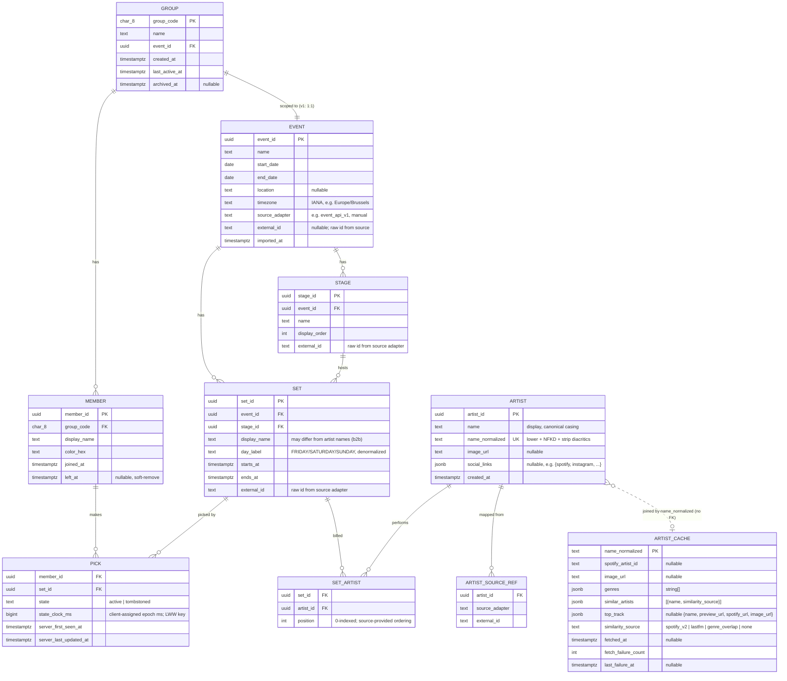

# ADR-006: Initial data schema (V001 baseline)

## Status
Proposed — pending sign-off from Jerome on the design-decisions log (§ 4).

## Context

Phase 1 of the [ROADMAP](../ROADMAP.md) creates the FastAPI skeleton and the first Alembic migration. Every backend ticket — group / member endpoints, pick sync, lineup import, artist drill-down — depends on the V001 schema landing first. Frontend TypeScript types are generated from the FastAPI OpenAPI schema, so the wire shape (Pydantic models) propagates into `apps/web` as soon as it's in code.

This ADR fixes the v1 schema. It must support:

- Anonymous, group-code-based group lifecycle ([ADR-003](ADR-003-auth-model.md)).
- Calendar UI ([calendar-spec](../features/calendar-spec.md)): event × day × stage × set with absolute timestamps.
- Friends list / group view ([friends-list-spec](../features/friends-list-spec.md)): per-member colors, per-set member dots, "right now" view, soft-leave.
- Artist drill-down ([artist-drilldown-spec](../features/artist-drilldown-spec.md)): global artist registry + cached Spotify/Last.fm data with backoff.
- Offline pick toggles with last-write-wins reconciliation ([ADR-004](ADR-004-offline-strategy.md)).
- Lossless round-trip of the source lineup JSON under the adapter pattern ([ADR-005](ADR-005-music-data-source.md)) — verified against [`.local-data/tml26-w2.json`](../../.local-data/tml26-w2.json) (405 performances, 15 stages, 420 artists, 35 b2b sets, 27 sets straddling midnight, 73 sets whose display name differs from the headlining artist name).

### Canonical UX flow (Jerome, 2026-06-18)

1. User creates a group → server generates the group code (which IS the invite — see § 4.11).
2. User shares the code out-of-band (text, screenshot, etc.).
3. Friend opens the app, enters the code + a display name → server creates a `member` row scoped to that group.
4. The FE persists `{group_code, member_id, display_name}` in localStorage as the user's "my groups" list. The server has no User entity (§ 4.12).
5. Inside a group: festival calendar with per-set picker dots (existing schema covers this).
6. Tap an artist → drill-down modal ([ADR-005](ADR-005-music-data-source.md), `artist_cache`).
7. Pick = "I'm going to this set." Public within the group (§ 4.14). LWW on offline sync (§ 4.5).
8. **Screenshotable "where will we be at time T" view** — the new snapshot endpoint (§ 4.15) returns a self-contained per-stage payload designed so a single screen capture is intelligible without any further context (event name, stage names, times, picker names + colors all on the same screen).

The ARCHITECTURE.md § Data model block has been slim-summarized; this ADR is the authoritative source from here forward.

---

## 1. Entity-relationship diagram



Notes on the diagram:

- `GROUP ↔ EVENT` is 1:1 in v1 (one group ↔ one event per [PRD § 4 Out of Scope](../PRD.md)). Modeled as `group.event_id FK` rather than a join table so v2 multi-event groups become an additive change (drop the FK, add `group_event` join).
- `ARTIST ↔ ARTIST_CACHE` is intentionally **not** a foreign key — the cache survives lineup re-imports with slightly different casing, per [artist-drilldown-spec](../features/artist-drilldown-spec.md). The join is by `name_normalized` at query time.
- `ARTIST_SOURCE_REF` is the multi-source mapping for the global Artist registry — see decision § 4.8.

---

## 2. Tables

Each table section: purpose · columns · indexes · FKs · example row.

Conventions used below:

- **Primary keys** are UUIDv7 (16-byte binary in Postgres, TEXT in SQLite) unless noted. Rationale: § 4.1.
- **Timestamps with timezone** are stored as `TIMESTAMPTZ` (Postgres) / ISO-8601 with offset (SQLite — SQLAlchemy roundtrips this transparently).
- **JSON columns** are `JSONB` (Postgres) / `JSON` (SQLite). SQLAlchemy's `JSON()` type handles both.
- **`source_adapter`** is a short identifier for the lineup adapter that produced a row, e.g. `event_api_v1`, `manual`.

### 2.1 `group`

The shared, anonymous coordination unit. Created by anyone; joined via the group-code URL.

| Column | Type | Nullable | Default | Rationale |
|---|---|---|---|---|
| `group_code` | `CHAR(8)` | NO | (assigned) | 8-char Crockford base32 ([PRD § 5.1](../PRD.md)); PK so the URL identifier is the FK target everywhere. |
| `name` | `TEXT` | NO | `'Friends 🎵'` | Per [PRD § 5.1](../PRD.md). |
| `event_id` | `UUID` | NO | — | One group ↔ one event in v1. |
| `created_at` | `TIMESTAMPTZ` | NO | `now()` | Group creation. |
| `last_active_at` | `TIMESTAMPTZ` | NO | `now()` | Updated on any write (pick add/remove, member join). Drives 90-day archival sweep. |
| `archived_at` | `TIMESTAMPTZ` | YES | NULL | Set when archival cron flips the group read-only. NULL = active. |

Indexes:

- PK `(group_code)`.
- `idx_group_archive_sweep (last_active_at) WHERE archived_at IS NULL` — partial index; serves the nightly archival sweep `SELECT … WHERE archived_at IS NULL AND last_active_at < now() - interval '90 days'`.

FKs: `event_id → event(event_id)`.

Example row:

```text
group_code      | AB7K9MNP
name            | Friends 🎵
event_id        | 0192d6f8-...-7b3a   (Tomorrowland 2026 W2)
created_at      | 2026-07-20T18:22:09+00:00
last_active_at  | 2026-07-25T14:01:33+00:00
archived_at     | NULL
```

### 2.2 `member`

A person's presence in a group. Created at join. UUID is the credential ([ADR-003](ADR-003-auth-model.md)). Devices = ephemeral; two devices joining as "Jerome" are two `member` rows.

| Column | Type | Nullable | Default | Rationale |
|---|---|---|---|---|
| `member_id` | `UUID` | NO | (UUIDv7) | Per § 4.1. Stored in a long-lived cookie; the credential. |
| `group_code` | `CHAR(8)` | NO | — | Scope. |
| `display_name` | `TEXT` | NO | — | Free text; uniqueness within group is **not** enforced — see open question § 5.2. |
| `color_hex` | `CHAR(7)` | NO | — | `#RRGGBB`. Assigned at join time from a fixed 12-color palette via BE-FL-002. Stored as resolved hex (not palette index) so future palette changes don't visually re-label existing members. |
| `joined_at` | `TIMESTAMPTZ` | NO | `now()` | Audit. |
| `left_at` | `TIMESTAMPTZ` | YES | NULL | Soft-remove per [friends-list-spec API contract](../features/friends-list-spec.md). NULL = present. Picks are retained for historical context. |

Indexes:

- PK `(member_id)`.
- `idx_member_group_active (group_code) WHERE left_at IS NULL` — partial; serves "list members of a group" (the hot path for the calendar's top-bar avatars).
- `idx_member_group_all (group_code)` — non-partial; needed for the "right now" view that may want to show recently-left members.

FKs: `group_code → group(group_code)`.

Example row:

```text
member_id     | 0192d701-...-83a4
group_code    | AB7K9MNP
display_name  | Jerome
color_hex     | #4F46E5
joined_at     | 2026-07-20T18:23:14+00:00
left_at       | NULL
```

### 2.3 `event`

A festival edition. The lineup-source adapter is named here so the import job knows how to round-trip and refresh.

| Column | Type | Nullable | Default | Rationale |
|---|---|---|---|---|
| `event_id` | `UUID` | NO | (UUIDv7) | § 4.1. |
| `name` | `TEXT` | NO | — | e.g. `Tomorrowland 2026 W2`. |
| `start_date` | `DATE` | NO | — | Local-date semantics; used for day-tab boundaries. |
| `end_date` | `DATE` | NO | — | Inclusive. |
| `location` | `TEXT` | YES | NULL | Optional, free text. |
| `timezone` | `TEXT` | NO | `'UTC'` | IANA name, e.g. `Europe/Brussels`. Drives day-boundary rendering — see § 4.2. |
| `source_adapter` | `TEXT` | NO | `'manual'` | Lineup adapter that produced this event's data. |
| `external_id` | `TEXT` | YES | NULL | Raw id from the adapter, e.g. the festival's internal event id. |
| `imported_at` | `TIMESTAMPTZ` | NO | `now()` | Set on insert and updated on re-import. |

Indexes:

- PK `(event_id)`.
- `uq_event_external (source_adapter, external_id) WHERE external_id IS NOT NULL` — unique partial; an event from a given adapter exists at most once.

FKs: none.

Example row:

```text
event_id        | 0192d6f8-...-7b3a
name            | Tomorrowland 2026 W2
start_date      | 2026-07-24
end_date        | 2026-07-26
location        | Boom, Belgium
timezone        | Europe/Brussels
source_adapter  | event_api_v1
external_id     | tml-2026-w2
imported_at     | 2026-07-20T11:00:00+00:00
```

### 2.4 `stage`

A stage within an event.

| Column | Type | Nullable | Default | Rationale |
|---|---|---|---|---|
| `stage_id` | `UUID` | NO | (UUIDv7) | Internal id, distinct from `external_id` so a re-import doesn't churn FKs. |
| `event_id` | `UUID` | NO | — | Scope. |
| `name` | `TEXT` | NO | — | e.g. `MAINSTAGE`. Stored verbatim from source. |
| `display_order` | `INTEGER` | NO | `0` | Calendar column order. Adapter may assign; otherwise alphabetical at import. |
| `external_id` | `TEXT` | NO | — | Raw id from the adapter; used by re-import to match existing rows. |

Indexes:

- PK `(stage_id)`.
- `uq_stage_external (event_id, external_id)` — unique; re-import matches by this pair.
- `idx_stage_event_order (event_id, display_order)` — serves stage-column rendering.

FKs: `event_id → event(event_id)` ON DELETE CASCADE.

Example row:

```text
stage_id       | 0192d6f9-...-1c4d
event_id       | 0192d6f8-...-7b3a
name           | PLANAXIS
display_order  | 2
external_id    | 2643140614
```

### 2.5 `set` (a.k.a. performance)

A single billed slot on a stage at an event. The source JSON calls this a "performance." The display name MAY differ from the artist's name (b2b sets — verified in the source data, 73/405 rows).

> SQL: `set` is a reserved word in some dialects. SQLAlchemy quotes it; we accept the small ergonomic hit to keep continuity with [ARCHITECTURE.md § Data model](../ARCHITECTURE.md).

| Column | Type | Nullable | Default | Rationale |
|---|---|---|---|---|
| `set_id` | `UUID` | NO | (UUIDv7) | § 4.1. |
| `event_id` | `UUID` | NO | — | Denormalized — present on `stage` too, but having it here removes a join in the hot "lineup for event" query. |
| `stage_id` | `UUID` | NO | — | Column on the calendar. |
| `display_name` | `TEXT` | NO | — | The set's billed name, verbatim from the source. May equal artist's name or be a b2b construct (e.g. `Chris Avantgarde b2b Konstantin Sibold`). |
| `day_label` | `TEXT` | NO | — | Source-provided day (`FRIDAY` / `SATURDAY` / `SUNDAY`). Denormalized for the FE day-tab grouping — see § 4.2. |
| `starts_at` | `TIMESTAMPTZ` | NO | — | Authoritative absolute time. |
| `ends_at` | `TIMESTAMPTZ` | NO | — | Authoritative absolute time. MAY be before midnight of the next day (27/405 source rows straddle midnight). MAY also include a `+1s` quirk from the source (every row in `.local-data/tml26-w2.json` ends with `:01`); we store the raw value, no normalization. |
| `external_id` | `TEXT` | NO | — | Raw id from the adapter; used by re-import to match existing rows. |

Indexes:

- PK `(set_id)`.
- `uq_set_external (event_id, external_id)` — unique; re-import matches by this pair.
- `idx_set_event_starts (event_id, starts_at)` — serves the day-view calendar query "all sets for this event ordered by time."
- `idx_set_stage_starts (stage_id, starts_at)` — serves the stage-filtered calendar query.

FKs: `event_id → event(event_id)` ON DELETE CASCADE; `stage_id → stage(stage_id)` ON DELETE CASCADE.

Example row (a b2b set from the TML data):

```text
set_id        | 0192d6fa-...-9e21
event_id      | 0192d6f8-...-7b3a
stage_id      | 0192d6f9-...-1c4d   (PLANAXIS)
display_name  | Chris Avantgarde b2b Konstantin Sibold
day_label     | SATURDAY
starts_at     | 2026-07-25T22:30:00+02:00
ends_at       | 2026-07-26T00:00:01+02:00     -- straddles midnight; SUNDAY date but SATURDAY day_label
external_id   | 3006674233
```

### 2.6 `artist`

Global artist registry. Deduplicated across events on `name_normalized`. Stores the rich source-provided fields (image, social links) when available, with the caveat that these are best-effort and may differ across sources.

| Column | Type | Nullable | Default | Rationale |
|---|---|---|---|---|
| `artist_id` | `UUID` | NO | (UUIDv7) | § 4.1. |
| `name` | `TEXT` | NO | — | Canonical display name. First-import wins; subsequent imports do not overwrite. |
| `name_normalized` | `TEXT` | NO | — | `lower(NFKD(strip_diacritics(name))).strip()`, whitespace collapsed. Dedup key. |
| `image_url` | `TEXT` | YES | NULL | From the source if provided. |
| `social_links` | `JSON` | YES | NULL | Loose-shape `{spotify, instagram, soundcloud, tiktok, twitter, facebook, youtube, website}` — every key optional. Source-provided. Verified field set against `.local-data/tml26-w2.json`. |
| `created_at` | `TIMESTAMPTZ` | NO | `now()` | Audit. |

Indexes:

- PK `(artist_id)`.
- `uq_artist_name_normalized (name_normalized)` — unique; the dedup key.

FKs: none.

Example row:

```text
artist_id        | 0192d6fb-...-4d12
name             | Chris Avantgarde
name_normalized  | chris avantgarde
image_url        | https://artist-lineup-cdn.tomorrowland.com/31828272-2047.jpg
social_links     | {"spotify": "https://open.spotify.com/artist/715OI7hiv58daVlEDXM47U", "instagram": "https://www.instagram.com/chrisavantgarde/"}
created_at       | 2026-07-20T11:00:03+00:00
```

### 2.7 `artist_source_ref`

Maps a global artist row to its raw id in each lineup source. Allows the same artist to appear in multiple festivals' data without polluting the global Artist row's identity.

| Column | Type | Nullable | Default | Rationale |
|---|---|---|---|---|
| `artist_id` | `UUID` | NO | — | FK. |
| `source_adapter` | `TEXT` | NO | — | e.g. `event_api_v1`. |
| `external_id` | `TEXT` | NO | — | Raw id from that adapter. |

Indexes:

- PK `(artist_id, source_adapter)` — at most one external id per artist per source.
- `uq_artist_source_ext (source_adapter, external_id)` — unique; the same `(adapter, ext_id)` pair cannot point to two artists.

FKs: `artist_id → artist(artist_id)` ON DELETE CASCADE.

Example row:

```text
artist_id        | 0192d6fb-...-4d12
source_adapter   | event_api_v1
external_id      | 1321214925
```

### 2.8 `set_artist`

The many-to-many join between Set and Artist. **Position is significant** — it preserves the source-provided artist ordering for the set (used in b2b display and provenance).

| Column | Type | Nullable | Default | Rationale |
|---|---|---|---|---|
| `set_id` | `UUID` | NO | — | FK. |
| `artist_id` | `UUID` | NO | — | FK. |
| `position` | `INTEGER` | NO | — | 0-indexed; source-provided ordering. |

Indexes:

- PK `(set_id, artist_id)`.
- `uq_set_position (set_id, position)` — unique; two artists cannot share a position within a set.
- `idx_setartist_artist (artist_id)` — serves "all sets featuring artist X" (member detail view, future "follow artist" feature).

FKs: `set_id → set(set_id)` ON DELETE CASCADE; `artist_id → artist(artist_id)` ON DELETE RESTRICT (deleting an Artist while sets still reference it is a data-integrity error — block it).

Example rows (for the b2b set in 2.5):

```text
set_id           | 0192d6fa-...-9e21
artist_id        | 0192d6fc-...-2a98   (Konstantin Sibold — first in source array)
position         | 0

set_id           | 0192d6fa-...-9e21
artist_id        | 0192d6fb-...-4d12   (Chris Avantgarde — second in source array)
position         | 1
```

Note: the source array order does **not** necessarily match the b2b display-name order (e.g. the row above is named "Chris Avantgarde b2b Konstantin Sibold" but the source `artists` array is `[Konstantin Sibold, Chris Avantgarde]`). We preserve the source's array order; the display name is independent.

### 2.9 `pick`

A member's intention to attend a set. Tombstoned on unpick (§ 4.6). LWW reconciliation on sync (§ 4.5).

| Column | Type | Nullable | Default | Rationale |
|---|---|---|---|---|
| `member_id` | `UUID` | NO | — | FK. |
| `set_id` | `UUID` | NO | — | FK. |
| `state` | `TEXT` | NO | `'active'` | Enum: `active` \| `tombstoned`. Stored as string for SQLite portability; Postgres can promote to native enum later. |
| `state_clock_ms` | `BIGINT` | NO | — | Client-assigned epoch milliseconds (UTC). The LWW key — see § 4.5. |
| `server_first_seen_at` | `TIMESTAMPTZ` | NO | `now()` | Set on row creation. Audit. |
| `server_last_updated_at` | `TIMESTAMPTZ` | NO | `now()` | Updated on every accepted state change. Audit + debug. |

Indexes:

- PK `(member_id, set_id)` — composite; identity is the pair.
- `idx_pick_set_active (set_id) WHERE state = 'active'` — partial; serves the hot "who's going to this set?" query for per-set member dots (calendar-spec FE-CAL-007). Partial keeps the index small — most picks are active; partial avoids tombstone bloat.
- `idx_pick_member_active (member_id) WHERE state = 'active'` — partial; serves the member-detail "my picks" query.

FKs: `member_id → member(member_id)` ON DELETE CASCADE; `set_id → set(set_id)` ON DELETE CASCADE.

Example row:

```text
member_id              | 0192d701-...-83a4
set_id                 | 0192d6fa-...-9e21
state                  | active
state_clock_ms         | 1753483209123
server_first_seen_at   | 2026-07-25T14:00:09+00:00
server_last_updated_at | 2026-07-25T14:00:09+00:00
```

### 2.10 `artist_cache`

Spotify / Last.fm / heuristic data, keyed by `name_normalized` (intentionally **decoupled from `artist.artist_id`** — survives re-imports with different casings).

| Column | Type | Nullable | Default | Rationale |
|---|---|---|---|---|
| `name_normalized` | `TEXT` | NO | — | PK. Same normalization rule as `artist.name_normalized`. |
| `display_name` | `TEXT` | YES | NULL | The name Spotify returned; for UI fallback if `artist` row missing. |
| `spotify_artist_id` | `TEXT` | YES | NULL | Spotify ID once known. |
| `image_url` | `TEXT` | YES | NULL | Best image from Spotify. |
| `genres` | `JSON` | YES | NULL | `string[]`, e.g. `["techno", "minimal"]`. Spotify-derived. |
| `similar_artists` | `JSON` | YES | NULL | `[{"name": "...", "similarity_source": "lastfm"}, ...]`. |
| `top_track` | `JSON` | YES | NULL | `{"name", "preview_url", "spotify_url", "image_url"}`. |
| `similarity_source` | `TEXT` | YES | NULL | Tag for which provider produced `similar_artists`: `spotify_v2` \| `lastfm` \| `genre_overlap` \| `none`. Per [ADR-005](ADR-005-music-data-source.md). |
| `fetched_at` | `TIMESTAMPTZ` | YES | NULL | Last successful fetch. NULL = never fetched. TTL check uses this. |
| `fetch_failure_count` | `INTEGER` | NO | `0` | Consecutive failures. Drives backoff per [ADR-005](ADR-005-music-data-source.md). Reset on success. |
| `last_failure_at` | `TIMESTAMPTZ` | YES | NULL | Most recent failure. Drives backoff window calculation. |

Indexes:

- PK `(name_normalized)`.
- `idx_artist_cache_fetched (fetched_at) WHERE fetched_at IS NOT NULL` — partial; serves the TTL refresh sweep `SELECT … WHERE fetched_at < now() - interval '7 days'`.

FKs: none (intentional — see § 4.3).

Example row:

```text
name_normalized      | chris avantgarde
display_name         | Chris Avantgarde
spotify_artist_id    | 715OI7hiv58daVlEDXM47U
image_url            | https://i.scdn.co/image/...
genres               | ["melodic techno", "minimal techno"]
similar_artists      | [{"name": "Adriatique", "similarity_source": "lastfm"}, ...]
top_track            | {"name": "Era", "preview_url": "https://...", "spotify_url": "https://...", "image_url": "https://..."}
similarity_source    | lastfm
fetched_at           | 2026-07-20T11:05:00+00:00
fetch_failure_count  | 0
last_failure_at      | NULL
```

---

## 3. Index inventory (day-1, justified)

Single table summarizing every non-PK index that exists at V001 boot, with the query that justifies it.

| Index | Table | Justifying query |
|---|---|---|
| `idx_group_archive_sweep (last_active_at) WHERE archived_at IS NULL` | group | Nightly archival sweep: groups inactive > 90 days. |
| `idx_member_group_active (group_code) WHERE left_at IS NULL` | member | Top-bar member avatars — hot path on every calendar load. |
| `idx_member_group_all (group_code)` | member | "Right now" view that includes recently-left members for context. |
| `uq_event_external (source_adapter, external_id) WHERE external_id IS NOT NULL` | event | Re-import idempotency: same `(adapter, ext_id)` updates instead of duplicating. |
| `uq_stage_external (event_id, external_id)` | stage | Re-import match. |
| `idx_stage_event_order (event_id, display_order)` | stage | Render stages in column order on the calendar. |
| `uq_set_external (event_id, external_id)` | set | Re-import match. |
| `idx_set_event_starts (event_id, starts_at)` | set | "Full lineup ordered by time" (GET /api/events/{id}/lineup). |
| `idx_set_stage_starts (stage_id, starts_at)` | set | Stage-filtered calendar view. |
| `uq_artist_name_normalized (name_normalized)` | artist | Dedup on import. |
| `uq_artist_source_ext (source_adapter, external_id)` | artist_source_ref | One `(adapter, ext_id)` pair → at most one artist. |
| `idx_setartist_artist (artist_id)` | set_artist | "All sets featuring artist X" (member detail view; future follow-artist feature). |
| `idx_pick_set_active (set_id) WHERE state = 'active'` | pick | Per-set member-dot rendering — hottest read path. |
| `idx_pick_member_active (member_id) WHERE state = 'active'` | pick | "My picks" / member detail view. |
| `idx_artist_cache_fetched (fetched_at) WHERE fetched_at IS NOT NULL` | artist_cache | TTL refresh sweep. |

> Both SQLite (≥ 3.8.0) and Postgres support partial indexes. All `WHERE`-clause indexes above are portable.

### 3.1 Justifying queries — full SQL for the load-bearing reads

These are the queries the hot read paths execute. They MUST stay in this ADR so a future schema-tweak PR can re-verify nothing regressed.

**Q1 — All active picks for a group, with member names + colors** (calendar's per-set dots, plus the `GET /api/groups/{code}` aggregate). Verifies the indexes from § 3 cover the canonical "all picks across all sets with member names" join.

```sql
SELECT p.member_id, p.set_id, p.state, p.state_clock_ms,
       m.display_name, m.color_hex
FROM   member m
JOIN   pick   p ON p.member_id = m.member_id
WHERE  m.group_code = $1            -- uses idx_member_group_active
  AND  m.left_at IS NULL
  AND  p.state = 'active';          -- uses idx_pick_member_active (partial)
```

Plan: index scan on `idx_member_group_active` for members of the group → for each member, index scan on `idx_pick_member_active` for active picks. No table scans.

**Q2 — Snapshot for "where will the group be at time T"** (powers the new snapshot endpoint, § 4.15). Returns every set active at T or starting within the window, grouped by stage, with picker member names + colors.

```sql
WITH window_sets AS (
    SELECT s.set_id, s.stage_id, s.display_name, s.day_label,
           s.starts_at, s.ends_at
    FROM   set s
    WHERE  s.event_id  = $1                 -- uses idx_set_event_starts
      AND  s.starts_at <  $at + ($window_minutes * interval '1 minute')
      AND  s.ends_at   >  $at
)
SELECT ws.*,
       st.name           AS stage_name,
       st.display_order,
       p.member_id,
       m.display_name,
       m.color_hex
FROM   window_sets ws
JOIN   stage  st ON st.stage_id  = ws.stage_id
LEFT JOIN pick p ON p.set_id     = ws.set_id
                AND p.state      = 'active'  -- uses idx_pick_set_active (partial)
LEFT JOIN member m ON m.member_id = p.member_id
                  AND m.group_code = $2
                  AND m.left_at   IS NULL
ORDER BY st.display_order, ws.starts_at;
```

Plan: index range scan on `idx_set_event_starts` narrows to the window → JOIN to stage by PK → LEFT JOIN to `idx_pick_set_active` (small partial index, fast) → LEFT JOIN to member by PK. The `m.group_code = $2` filter on the LEFT JOIN side ensures picks from members of OTHER groups (which can't happen with current schema but is defensive) don't leak. No table scans.

**Q3 — Artist drill-down cache lookup** (`GET /api/artists/{name}`). Trivial — single PK lookup on `artist_cache(name_normalized)` after server-side normalization. Documented for completeness.

```sql
SELECT * FROM artist_cache WHERE name_normalized = $1;
```

---

## 4. Design decisions log

Each decision: chosen option · reasoning · alternative considered · why rejected.

### 4.1 Primary keys — UUIDv7 across the board (except `group_code` and `artist_cache`)

**Chosen.** UUIDv7 (RFC 9562) for `member`, `event`, `stage`, `set`, `artist`. `group` keeps `group_code` (8-char Crockford base32) as its PK. `artist_cache` keys on `name_normalized`.

Reasoning:

- **Time-ordered sortability** — UUIDv7's leading 48-bit ms timestamp means index inserts cluster temporally, avoiding the page-fragmentation pain of UUIDv4 in B-trees. Matters as `set` and `pick` grow.
- **Offline ID generation** — clients (per [ADR-004](ADR-004-offline-strategy.md)) need to be able to mint stable identifiers before reconnecting. UUIDs let `member_id` be assigned client-side at join with zero round-trip. Autoincrement integers require a server round-trip.
- **No information disclosure** — sequential integer ids leak group/event sizes via the URL or admin endpoints. UUIDs don't.
- **`group_code` exception** — already user-facing in the URL (`/g/AB7K9MNP`); making it the PK saves a column and an indirection. The 8-char fixed length keeps FK rows small.
- **`artist_cache` exception** — keying by `name_normalized` is correct by design ([ADR-005](ADR-005-music-data-source.md)): the cache survives re-imports with different artist-row identities. A surrogate UUID would just be a second key we'd have to maintain alongside the natural one.

Alternative — **autoincrement BIGINT**: rejected. Loses offline-ID generation and information non-disclosure. Faster inserts marginally, but UUIDv7 closes most of that gap (no random index churn).

Alternative — **ULID**: rejected. Functionally similar to UUIDv7 but with smaller ecosystem support in Python + SQLAlchemy. UUIDv7 is now an IETF standard and the ergonomic default.

### 4.2 Time zones — `TIMESTAMPTZ` + `event.timezone`

**Chosen.** Store all timestamps as `TIMESTAMPTZ` (Postgres) or ISO-8601-with-offset (SQLite — round-trips via SQLAlchemy's `DateTime(timezone=True)`). Store `event.timezone` as an IANA name (e.g. `Europe/Brussels`).

Reasoning:

- **`TIMESTAMPTZ` preserves the absolute instant.** No ambiguity around DST or local-vs-UTC display. The FE renders local time using the event's timezone.
- **`event.timezone` enables correct day boundaries.** The FE's day-tab logic (FRIDAY/SATURDAY/SUNDAY) needs to know that "midnight" means CEST midnight, not UTC midnight. Without this, the 27 sets that straddle midnight in TML's data would render on the wrong day tab.
- **`set.day_label` is denormalized for FE convenience.** The source provides it, the FE wants it (a set that ends after midnight still belongs to the previous day's tab — verified against the data). Computing it on the FE would require re-deriving the festival's day-rollover semantics; trust the source.
- The `+1s` end-time quirk in the source data is stored verbatim — we don't normalize. Documented in 2.5.

Alternative — **naive timestamps + a separate timezone column on each row**: rejected. More columns, more chances for the FE to forget to apply the offset. `TIMESTAMPTZ` is the safer default.

Alternative — **store everything as UTC, derive local on the FE**: this is what we're doing — `TIMESTAMPTZ` stores the absolute instant. The clarification is that we also keep `event.timezone` and `set.day_label` so the FE doesn't have to redo the source's day-rollover logic.

### 4.3 Artist deduplication — `name_normalized` with unique index

**Chosen.** `artist.name_normalized = lower(NFKD(strip_diacritics(name))).strip()` with whitespace collapsed to single spaces. Unique index.

Reasoning:

- **NFKD + diacritic strip** handles "Beyoncé" vs "Beyonce", "DXNØ" vs "DXNO" gracefully.
- **Lowercase** handles "BISOUX" / "Bisoux" / "bisoux" — verified against the source data which is inconsistent on casing.
- **Whitespace collapse** handles "DJ  Example" (double space) vs "DJ Example".

Alternative — **fuzzy match (Levenshtein, soundex)**: rejected for v1. False positives (collapsing two distinct artists into one row) are worse than false negatives (occasional duplicate). A future migration can introduce a manual-merge admin tool.

Alternative — **case-insensitive collation only**: rejected. Doesn't handle diacritics, and SQLite's default `NOCASE` only covers ASCII. Explicit normalization is portable and predictable.

### 4.4 Set ↔ Artist join — `set_artist` with PK `(set_id, artist_id)` and uniqueness on `(set_id, position)`

**Chosen.** Per § 2.8. Position is 0-indexed source-provided order.

Reasoning:

- **Composite PK on the pair** is the natural identity — an artist can be on a set at most once.
- **Unique `(set_id, position)`** prevents accidental position collisions on re-import.
- **Position is source-array order**, not display-name order. The source's array ordering is preserved verbatim; the b2b display name in `set.display_name` is independent (verified that source array order ≠ display-name order in TML's data).

Alternative — **single `is_primary` flag instead of position**: rejected. Loses ordering for b2b billing.

Alternative — **store ordering as `artist_ids: jsonb[]` on `set`**: rejected. Loses referential integrity and the index that powers "all sets featuring artist X."

### 4.5 Pick concurrency — LWW with client-assigned millisecond clock

**Chosen.** Client sends `state_clock_ms` (Unix epoch ms). Server accepts the write if `incoming.state_clock_ms > existing.state_clock_ms`. Tie-break: server timestamp (last accept wins).

Algorithm (upsert):

```
INPUT: (member_id, set_id, new_state, client_clock_ms)
1. SELECT state, state_clock_ms FROM pick WHERE member_id = $1 AND set_id = $2;
2. IF no row:
     INSERT (member_id, set_id, new_state, client_clock_ms, now(), now());
3. ELIF client_clock_ms > existing.state_clock_ms:
     UPDATE state = new_state, state_clock_ms = client_clock_ms, server_last_updated_at = now();
4. ELIF client_clock_ms == existing.state_clock_ms AND new_state != existing.state:
     UPDATE state = new_state, server_last_updated_at = now();  -- tie-break: server-receive order wins
5. ELSE: discard (older mutation, ignore).
```

Reasoning:

- **Client-assigned** because the offline-mode user has been mutating without server contact ([ADR-004](ADR-004-offline-strategy.md)); the server first sees the mutation at sync time. The client's `queued_at` is the only meaningful ordering. Server-assigned clocks would lose the offline ordering entirely.
- **Milliseconds** is granular enough that two human-driven taps on the same device rarely tie. BIGINT is comfortable.
- **Tie-break by server receive order** — the rare same-ms case (different devices, same `member_id` in a multi-device "Jerome" scenario) resolves deterministically.

Known limits:

- **Client clock skew** — if a phone's clock is wildly wrong, that phone's writes will dominate or be ignored. Mitigation: document; in v1 the multi-device-same-member case is rare ([ADR-003](ADR-003-auth-model.md)).
- **Tombstone-then-recreate within tied-clock window** — see § 4.6 for why this is fine.

Alternative — **server-assigned clocks**: rejected. Server can't reconstruct the offline ordering of a queue flush.

Alternative — **vector clocks / CRDT**: rejected per [ADR-004](ADR-004-offline-strategy.md) — mutation surface is too small to justify.

### 4.6 Soft delete on Pick — tombstone with `state` column, not hard delete

**Chosen.** Pick row stays in place; `state` flips between `active` and `tombstoned`. `state_clock_ms` updates on every transition.

Reasoning:

- **Unambiguous LWW.** If a user toggles pick on (clock=100) → off (clock=200) offline, then syncs out of order (off-mutation arrives first, on-mutation arrives second): hard delete would re-create the pick on the second sync, since the server has no memory of the delete clock. Tombstone preserves the delete clock and the second (older) mutation is correctly discarded.
- **No row churn.** Toggling the same pick on/off many times is a single row with a state flip, not a delete+insert.
- **Audit trail.** `server_first_seen_at` survives all toggles — useful for analytics ("when did Jerome first add this pick?").

Garbage collection: tombstones older than 90 days (i.e. once the group has archived) can be purged in the archival sweep. Not part of V001.

Alternative — **append-only ledger** (every toggle is a new row): rejected. Read path becomes "GROUP BY (member_id, set_id) ORDER BY clock DESC LIMIT 1" everywhere; the dot-rendering hot path slows down. Tombstone-on-the-same-row is cheaper.

Alternative — **hard delete**: rejected per the LWW-correctness argument above.

### 4.7 Indexes — see § 3

Decisions live in the table in § 3. The summary rule: index every query the day-1 endpoints execute; don't index things v1 doesn't read.

### 4.8 External-id collisions — `(source_adapter, external_id)` on each entity; multi-source via `artist_source_ref`

**Chosen.** For per-event entities (`event`, `stage`, `set`), store `source_adapter` + `external_id` on the row, unique together. For the global `artist` registry, use a separate `artist_source_ref(artist_id, source_adapter, external_id)` table — one artist may appear in multiple lineup sources.

Reasoning:

- **Per-event entities are scoped to their event's source** — Stages and Sets live and die with the Event that imported them. Storing the adapter on the event implies the adapter for those rows; redundantly storing it on Stage/Set lets us treat each row standalone without joining to Event (small ergonomic win).
- **Artists are global** — the same artist can be in TML's data and a hypothetical second festival's data. A separate ref table allows N source ids per artist.
- **Unique constraints prevent collision** — `(source_adapter, external_id)` is unique per entity type; raw collisions across sources cannot create accidental joins.

Alternative — **single `external_id_map: jsonb` column on each row** (`{"event_api_v1": "1234"}`): rejected. Loses unique constraints; no indexable lookup.

Alternative — **artist as per-source rather than global**: rejected. Defeats the dedup story and explodes the artist count.

### 4.9 Migration ordering — everything in V001 baseline

**Chosen.** All 10 tables land in the V001 Alembic migration. Zero users at this point; clean slate.

Reasoning:

- **No backfill burden.** With zero rows in production, V001 can establish the full constraint set without worrying about pre-existing data.
- **Coherence.** Splitting across multiple migrations adds review surface without buying anything — there's no incremental safety win when nothing's live.
- **Future ALTERs are cheap** — adding nullable columns, new tables, new indexes is straightforward in Alembic; the V001 baseline doesn't lock us in.

Alternative — **V001 = core (group/member/event/stage/set/pick), V002 = artist + artist_cache**: rejected. Artist drill-down is scheduled for Phase 4 ([ROADMAP](../ROADMAP.md)) but the lineup-import (Phase 1) already creates Artist rows. Splitting the migration means Phase 1 has to either skip artists or write into a table that's about to be schema-altered.

### 4.10 Wire shape — Pydantic v2, snake_case, mirrored from the table layer

**Chosen.** See [`docs/schemas/reference/v1_pydantic.py`](../schemas/reference/v1_pydantic.py). One request and one response model per endpoint hinted at by the feature specs.

Reasoning:

- **snake_case** per [CLAUDE.md](../../CLAUDE.md) — wire format is consistently snake_case end-to-end. Pydantic v2's default field naming matches; no `alias_generator` gymnastics.
- **Mirror, don't duplicate.** Response models project the table columns the FE actually needs (e.g. `pick` exposes `state` and `state_clock_ms`; the server-only `server_*_at` audit columns stay hidden). The Pydantic file documents this projection.
- **One request and one response per endpoint** rather than reusing one model for both — request and response surfaces drift over time, and conflating them creates "is this a write field or a read field?" ambiguity.

The reference file is **not** wired into the API yet (no FastAPI imports). It exists for the Phase 1 implementer to copy-and-adapt with confidence in the field set.

### 4.11 Invite code = group code — no separate invite table

**Chosen.** The 8-char Crockford base32 `group_code` IS the invite. The invite URL is `https://setlist-picker.example/g/AB7K9MNP`. There is no separate `invite_token` table, no expiry, no rotation.

Reasoning:

- **The URL is already the credential** per [ADR-003](ADR-003-auth-model.md). A separate invite token would be a second credential surface to leak.
- **No expiry to manage** — codes live as long as the group does (90-day inactivity archives the group per [PRD § 5.1](../PRD.md)).
- **Operational simplicity** — group creators don't have to think about "is my invite link still valid?" — it always is, until the group archives.

Implication: a group code can't be rotated. If a code leaks publicly, the recourse is to create a new group and re-invite. Documented as accepted tradeoff per [ADR-003](ADR-003-auth-model.md) ("anyone with the URL has full group access — that's the deal, like a Google Doc share link").

Alternative — **separate `invite_token` table with TTL** (e.g. `(token, group_code, expires_at, revoked_at)`): rejected. Adds plumbing for zero v1 benefit, contradicts ADR-003's "URL is the credential" model, and would require either a UI for re-issuing tokens or a CLI / admin endpoint (more surface, more PII-ish concerns about "who issued which invite").

### 4.12 No User entity — "my groups" persists on the device

**Chosen.** There is no server-side `user` (or `device`, or `account`) entity. The server only knows `group → member` rows. The FE persists `{group_code, member_id, display_name}[]` in **localStorage** as the user's "my groups" list. Each entry is independent — `member_id` is per-group, not per-person.

Reasoning:

- **Zero-PII commitment** per [ADR-003](ADR-003-auth-model.md) — no email, no account, no cross-device identity.
- **One model for "device" and "person"** — both are absent. A "user" in this product is the intersection of a device and a group code. Modeling that on the server is overkill for v1.
- **The FE's localStorage list is the only place** that knows "Jerome is in groups AB7K9MNP and XY42PQRS." The server can answer "give me group X's members" but cannot answer "give me Jerome's groups" — by design.

Implication for the API surface: there is no `GET /api/users/me/groups` endpoint. The FE iterates its localStorage list, calling `GET /api/groups/{code}` for each. Stale entries (404 → group archived or deleted) are pruned by the FE.

Forward-compat: a v2 "claim my group" magic-link flow ([ADR-003 § Forward compat](ADR-003-auth-model.md)) layers an OPTIONAL `user` table on top — Member rows survive unchanged, just gain a nullable `user_id` FK. The localStorage model still works for unauthenticated users.

Alternative — **server-side device row keyed by an anonymous device cookie**: rejected. Adds a row per device-per-group with no behavior we can't already get from localStorage. Trades local complexity for server complexity in the wrong direction.

### 4.13 Member rejoin = new Member row

**Chosen.** When a user clears localStorage and re-enters the same group code + same display name, the server creates a **new** `member` row with a fresh `member_id`. The previous member row stays (with its picks intact); the FE has no way to recover it.

Reasoning:

- **No auth, no way to prove identity.** "I am the same Jerome who joined yesterday" is unverifiable. Allowing dedup on `(group_code, display_name)` would let any device claim any name in the group.
- **Consistent with [ADR-003](ADR-003-auth-model.md)** — "a phone and laptop joining as Jerome are two distinct presences." This is the same case, separated in time instead of in space.
- **The FE handles the UX** — if it detects (via local-history or a separate "I've been here" flow) that this user previously had picks in the group, it can prompt: "Looks like you joined as 'Jerome' before — want to re-pick those sets?" The re-pick happens via fresh `POST /picks` calls under the new `member_id`. No server-side identity migration.

Implication: the old member row appears in the group's member list (with whatever picks it had) until the group archives. UI considerations (e.g. fading out members with no recent activity) are out of scope for this ADR.

Alternative — **server-side dedup on `(group_code, lower(display_name))`** with the new join inheriting the old `member_id`: rejected. Contradicts ADR-003 and creates a name-squatting vulnerability (anyone joining with the same name takes over the original member's identity, including their picks).

### 4.14 Picks are public within a group — no privacy flag

**Chosen.** Every active pick is visible to every member of the group. There is no `is_private` flag, no "reveal at start time," no per-pick visibility scoping.

Reasoning:

- **Per [PRD § 1](../PRD.md)**, the whole product is "see who's where." Hiding picks defeats the use case.
- **Schema simplicity** — no column means no logic branch in any read query, no "did the FE remember to filter?" footgun.
- **Out of scope for v1** — surveillance / discomfort concerns are flagged in the open questions section of the PRD; v1 ships without them.

Implication: a member who wants to hide a pick must un-pick it (tombstone). There is no other recourse.

Forward-compat: adding a nullable `visibility` column to `pick` (e.g. `'public' | 'private' | 'reveal_at_start'`) is a backward-compatible migration. Existing rows default to `public`.

Alternative — **`pick.visibility` enum from day 1**: rejected. Not in scope, adds a "did I remember to filter?" cliff to every pick read, with no v1 product need.

### 4.15 Screenshotable "snapshot" endpoint — `GET /api/groups/{code}/snapshot`

**Chosen.** Add `GET /api/groups/{code}/snapshot?at={iso_time}&window_minutes={int}` (default `at=now`, `window_minutes=60`). Returns a per-stage view of sets active or starting within `[at, at + window]`, each annotated with picker member names + colors. The wire shape is designed so a single rendered screen capture is intelligible without further context — event name, stage names, set times, picker names + colors are all on the same payload.

Powered by **existing indexes** (`idx_set_event_starts`, `idx_pick_set_active`, `idx_member_group_active`). **No new index** required — Q2 in § 3.1 verifies the plan. **No schema change** required.

Wire shape: `GroupSnapshotResponse` in [`docs/schemas/reference/v1_pydantic.py`](../schemas/reference/v1_pydantic.py).

Design rules for "screenshotable":

- **Event name + group name + snapshot time + IANA timezone** in the top-level payload — the screenshot's audience may not know the festival or the group.
- **Stage names alongside stage IDs** — a screenshot won't be hovered for tooltips.
- **`artist_names: list[str]`** denormalized onto each `SnapshotSet` — saves the screenshot renderer from a per-set artist lookup and ensures the b2b display reads correctly.
- **Picker `display_name` + `color_hex`** denormalized onto each `SnapshotSet` — the screenshot must be self-explanatory; resolving an opaque `member_id` from a separate `members` block defeats the purpose.
- **Stage ordering by `stage.display_order`**, sets within a stage ordered by `starts_at` ascending — so the rendered output is layout-deterministic across captures.

Reasoning for splitting this out from `GET /api/groups/{code}`:

- The group-state endpoint is **polled every 5 seconds** ([ARCHITECTURE.md § Real-time strategy](../ARCHITECTURE.md)). The snapshot endpoint is hit **on user demand** (open the screenshot view). Different cache strategies (the snapshot can be aggressively cached for 30s server-side; group state can't).
- The snapshot payload bundles cross-table denormalized fields (artist names per set, member names per pick) that the polled endpoint doesn't need — bloating the polled endpoint hurts mobile data.

Alternative — **derive the snapshot client-side from the polled group-state + lineup cache**: rejected. The FE assembly logic is non-trivial (window math, per-stage grouping, sort stability), and the screenshot use case demands a payload that round-trips identically across captures of the same `(at, window)` regardless of which member is screenshotting. A server-side endpoint guarantees that.

---

## 5. Open questions (flagged for Jerome)

### 5.1 Optional v1 features that touch the schema — confirm all deferred?

The task brief lists three "(optional v1, decide & document)" candidates:

- **Message/chat per group** — PRD § 4 explicitly lists "Direct messaging between members" as out-of-scope. **Recommendation: defer to v2.** No table now.
- **Reactions on picks** — not in PRD. **Recommendation: defer.** No table now.
- **Friend-of-friend conflict highlighting source** — N/A for v1 (one group ↔ one event; the conflict highlighting in [calendar-spec § Conflict highlighting](../features/calendar-spec.md) is per-member only, not cross-group). **Recommendation: defer.** No table now.

**Confirm:** OK to defer all three with no schema reservation now?

### 5.2 Display-name uniqueness within a group

[PRD § 8 Q3](../PRD.md) says defer ("most groups will self-police"). This ADR follows that — `member.display_name` has no uniqueness constraint. **Confirm:** OK to leave unenforced? An optional `idx_member_group_name (group_code, display_name)` would be cheap if you want the join endpoint to surface "Jerome (2)"-style disambiguation later; not in V001.

### 5.3 Client clock skew tolerance

§ 4.5 sets LWW on a client-assigned `state_clock_ms`. A phone with a wildly wrong clock (years in the future) will have its writes dominate forever. **Options:**

- (A) Accept it — document as known limit.
- (B) Reject writes whose `state_clock_ms` is more than 1 hour ahead of the server's clock.
- (C) Clamp `state_clock_ms` to `min(client_clock_ms, server_now_ms + small_buffer)` on accept.

**Recommendation: (B), reject far-future writes** — small implementation cost, prevents the worst-case lockout. Not in V001 unless you want it explicit; can land as a guard in the pick service.

### 5.4 Lineup import audit row

ADR-005 mentions `cache_prewarm` as an audit row. For the admin paste-import endpoint, a similar `lineup_import` audit row (when, by whom, summary counts) would help debugging — "why does the lineup look weird? oh, it was re-imported 2 hours ago." **Not in V001 as designed**; would land as a small additive migration. **Confirm:** defer?

### 5.5 Group ↔ Event coupling

V1: one group ↔ one event, modeled as `group.event_id FK`. The Phase 1 backend will most likely return event data joined to group state, since the FE only ever cares about a group in the context of its event. **Confirm:** OK that `GET /api/groups/{code}` returns embedded event details + lineup pointer rather than requiring a second call to `/api/events/{event_id}/lineup`?

### 5.6 Member color assignment — server-side deterministic vs random

[friends-list-spec BE-FL-002](../features/friends-list-spec.md) says "picks the least-used color from the 12-palette." V001 stores `color_hex` as the resolved hex, but **does the assignment algorithm need to be deterministic for testability** (e.g. seed on `group_code + joined_at`), or is "least-used, ties broken arbitrarily" sufficient? **Recommendation: least-used; ties broken by palette index ascending** — deterministic enough for tests, no extra state to track.

---

## 6. Migration plan — V001 baseline

V001 creates everything in this ADR. The Alembic migration will follow this order (FK dependencies):

1. `event`
2. `group` (FK → event)
3. `member` (FK → group)
4. `stage` (FK → event)
5. `set` (FK → event, stage)
6. `artist`
7. `artist_source_ref` (FK → artist)
8. `set_artist` (FK → set, artist)
9. `pick` (FK → member, set)
10. `artist_cache`

Then all indexes from § 3.

**Migration is out of scope for this PR** ([CLAUDE.md hard rule: ticket-sized changes](../../CLAUDE.md) — design and implementation land in separate PRs). The Phase 1 BE-CORE-001-ish ticket reads this ADR and writes the migration.

> When that ticket runs: per [CLAUDE.md](../../CLAUDE.md), `ls services/api/alembic/versions/ | tail -5` before generating the migration. V001 will be the first.

SQL stubs (one example to anchor the ticket implementer):

```sql
CREATE TABLE event (
    event_id        UUID PRIMARY KEY,
    name            TEXT NOT NULL,
    start_date      DATE NOT NULL,
    end_date        DATE NOT NULL,
    location        TEXT,
    timezone        TEXT NOT NULL DEFAULT 'UTC',
    source_adapter  TEXT NOT NULL DEFAULT 'manual',
    external_id     TEXT,
    imported_at     TIMESTAMP WITH TIME ZONE NOT NULL DEFAULT now()
);
CREATE UNIQUE INDEX uq_event_external
    ON event (source_adapter, external_id)
    WHERE external_id IS NOT NULL;
```

The full SQL is **deliberately not in this ADR** — it belongs in the Alembic file, not duplicated in docs.

---

## 7. References

- [PRD.md](../PRD.md)
- [ARCHITECTURE.md § Data model](../ARCHITECTURE.md) (now a slim summary pointing here)
- [ADR-003 — Auth model](ADR-003-auth-model.md) (group code + member UUIDs)
- [ADR-004 — Offline strategy](ADR-004-offline-strategy.md) (LWW reconciliation)
- [ADR-005 — Music data source](ADR-005-music-data-source.md) (artist_cache shape, fallback chain)
- [features/calendar-spec.md](../features/calendar-spec.md)
- [features/friends-list-spec.md](../features/friends-list-spec.md)
- [features/artist-drilldown-spec.md](../features/artist-drilldown-spec.md)
- [`docs/schemas/reference/v1_pydantic.py`](../schemas/reference/v1_pydantic.py) — Pydantic v2 reference shapes for every v1 endpoint
- [`.local-data/tml26-w2.json`](../../.local-data/tml26-w2.json) — round-trip test fixture (gitignored; not checked in)
